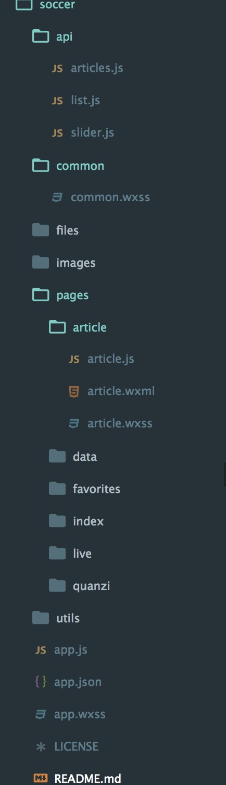

# 微信小程序 -- 懂球帝webApp #

## 关于 ##

* 微信小程序公布后在圈内引起热议，本人在工作之余也想体验一下

* 该应用模仿[懂球帝APP](http://www.dongqiudi.com)的一个微信小程序开发

* 目前完成新闻列表页及新闻详情页的开发

* 应用持续开发中

## 预览 ##

* 截图预览

<p align="center">
    
</p>

* 代码截图

<p align="left">
    
</p>

## 初尝感受 ##

* 作为一名开发者，我更注重微信小程序对开发者体验。

* 微信小程序提供了一套基础组件库，可以满足开发的基础开发需求，从而实现简单的快速开发；提供了比较完整的API，能够开发更丰富的功能和程序。

* 微信小程序引入新的文件类型(wxhtml,wxss)然而，这感觉有点不明所以然...

* 微信小程序并不兼容html，它与H5并没有什么关系...

* 吐槽：微信小程序框架比较死板，页面结构必须是将页面的xml文件、页面css、页面js文件放到同一个页面目录下，由app.json定义路由，不便于使用webpack,gulp等工程化开发。本人亲测，在根目录下建立package.json使用npm安装包直接使微信开发者工具崩溃(在根目录下新建一层文件夹，在内部使用package.json及搭配webpack,gulp等工具，然后编译出于微信小程序对应文件结构，或许可以实现....)

## 使用步骤

1. 克隆代码:

```bash
$ cd path/to/your/workspace
$ git clone https://github.com/Phlen/soccer.git
```
2. 打开`微信Web开放者工具`（注意：须`v0.10.101100`及以上版本）

3. 添加项目

    * AppID：选`无AppID`
    * 项目名称：任意填写
    * 项目目录：path/to/your/workspace
    * 点击 `添加项目`

## 小程序开发相关资源 ##

### 开发者工具下载 ###

> 最新版本 0.10.101100

- [windows 64](https://servicewechat.com/wxa-dev-logic/download_redirect?type=x64&from=mpwiki&t=1476434677599)
- [windows 32](https://servicewechat.com/wxa-dev-logic/download_redirect?type=ia32&from=mpwiki&t=1476434677599)
- [mac](https://servicewechat.com/wxa-dev-logic/download_redirect?type=darwin&from=mpwiki&t=1476434677599)

### 开发者文档 ###

- [微信官方文档](https://mp.weixin.qq.com/debug/wxadoc/dev/)

